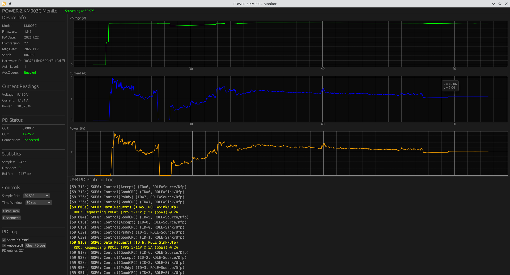

<h1 align="center">km003c-rs</h1>

<p align="center">Typed Rust library, CLI tools, GUI monitor, and Python bindings for the ChargerLAB POWER-Z KM003C USB-C power analyzer.</p>

<p align="center">
  <a href="https://github.com/okhsunrog/km003c-rs/actions/workflows/ci.yml"></a>
  
</p>

## Overview

`km003c-rs` provides asynchronous device communication, recorded-packet
parsing, real-time power analysis, and USB Power Delivery capture. Physical
values in the Rust API are type-safe [`uom`](https://docs.rs/uom) quantities.



## Features

### Device Communication
- Dual interface support: Vendor (bulk, ~0.6ms latency) or HID (interrupt)
- Cross-platform support using `nusb`
- Asynchronous communication with Tokio
- Automatic device discovery, initialization, and authentication

### ADC Data Acquisition
- Real-time voltage, current, and power measurements
- Two modes:
  - **Simple ADC**: Single-shot readings with temperature and statistics
  - **AdcQueue streaming**: High-speed continuous streaming (2, 10, 50, 1000 SPS)
- USB data line voltage measurements (D+, D-)
- USB-C CC line voltage measurements (CC1, CC2)

### USB Power Delivery Support
- Capture and parse USB PD messages
- Connection/disconnection event detection
- Full PD message parsing using the `usbpd` crate
- Support for SPR and EPR source capabilities
- Chunked message reassembly for EPR

### Device Information
- Model, firmware version, hardware version
- Serial number and UUID
- Hardware ID and authentication level

## Components

### `km003c-lib`
Core library providing:
- Device communication and automatic initialization
- Streaming authentication (required for AdcQueue)
- ADC and AdcQueue data parsing
- USB PD event parsing

### `km003c-cli`
Command-line tools:
- `adc_simple` - Single-shot ADC readings with device info
- `adc_queue_simple` - AdcQueue streaming demo
- `test_usbpd` - USB PD negotiation capture

### `km003c-egui`
GUI application featuring:
- Real-time voltage/current/power plots
- AdcQueue streaming with configurable sample rates
- Adjustable time window (2s to 5min or all data)
- Device info panel with auth status
- Connect/disconnect control

### Python Bindings

Python bindings expose the parser using numeric properties with explicit unit
suffixes such as `vbus_v`, `ibus_a`, and `power_w`.

## Quick Start

### Prerequisites
- Rust 1.92+ (the library and CLI support Rust 1.89+)
- USB access permissions (udev rules on Linux)
- POWER-Z KM003C device

### Installation

```bash
git clone https://github.com/okhsunrog/km003c-rs.git
cd km003c-rs
cargo build --release
```

### Linux USB Permissions

Create udev rules for non-root access:

```bash
sudo cp 71-powerz-km003c.rules /etc/udev/rules.d/
sudo udevadm control --reload-rules
sudo udevadm trigger
```

The rules use the `uaccess` tag for secure, dynamic access to logged-in users.

### Usage Examples

#### ADC Reading

```bash
cargo run --bin adc_simple
```

#### AdcQueue Streaming

```bash
cargo run --bin adc_queue_simple -- --rate 50 --duration 10
```

#### USB PD Capture

```bash
cargo run --bin test_usbpd
```

#### GUI Application

```bash
cargo run --bin km003c-egui
```

## Library Usage

```rust
use km003c_lib::uom::si::electric_current::ampere;
use km003c_lib::uom::si::electric_potential::volt;
use km003c_lib::{DeviceConfig, GraphSampleRate, KM003C};

#[tokio::main]
async fn main() -> Result<(), Box<dyn std::error::Error>> {
    // Connect with vendor interface (Full mode - includes init and auth)
    let mut device = KM003C::new(DeviceConfig::vendor()).await?;

    // Access device info (always available in Full mode)
    let state = device.state().unwrap();
    println!("{}", state);  // Pretty-printed device info
    println!("AdcQueue enabled: {}", state.adcqueue_enabled);

    // Simple ADC reading
    let adc = device.request_adc_data().await?;
    println!("Voltage: {:.3} V", adc.vbus.get::<volt>());
    println!("Current: {:.3} A", adc.ibus.get::<ampere>());

    // AdcQueue streaming (if authenticated)
    if device.adcqueue_enabled() {
        device.start_graph_mode(GraphSampleRate::Sps50).await?;
        // ... poll for samples ...
        device.stop_graph_mode().await?;
    }

    Ok(())
}
```

### Python bindings

Build and test the extension in the project environment:

```bash
uv sync --locked
uv run maturin develop
uv run pytest -q test_bindings.py
```

### Device Configuration

```rust
// Vendor interface (Full mode) - recommended, fastest
let config = DeviceConfig::vendor();

// HID interface (Basic mode) - most compatible, ADC/PD polling only
let config = DeviceConfig::hid();

// Skip USB reset (default on macOS for compatibility)
let config = DeviceConfig::vendor().skip_reset();
```

## Protocol Research

This implementation is based on reverse engineering documented at:
**[km003c-protocol-research](https://github.com/okhsunrog/km003c-protocol-research)**

The research repository contains:
- Complete protocol specification
- USB transport documentation
- PCAPNG captures and analysis tools
- Firmware analysis notes

## Development Status

### Working Features
- Device discovery and dual-interface communication
- Automatic initialization and streaming authentication
- Simple ADC measurements
- AdcQueue high-speed streaming (2-1000 SPS)
- USB PD message capture and parsing
- Memory read for device info/calibration
- Real-time GUI with plotting

### Validation

| Target | Coverage |
|---|---|
| Linux | Tests, lint, docs, package verification, and real KM003C hardware |
| macOS | Workspace compile check; USB reset is skipped by default |
| Windows | Workspace compile check |
| Python 3.13 | Extension build and binding tests |

Protocol tests use recorded device traffic and do not require USB hardware.
Live testing was performed on firmware 1.9.9 with a Pixel 8 Pro PPS charging
through the meter. AdcQueue sequence timing was checked at 2, 10, 50, and
1000 SPS; auxiliary CC/D-line scaling was compared with simultaneous ADC
measurements.

## Development

Common tasks are available through [`just`](https://just.systems):

```bash
just fmt
just test
just lint
just ci
```

Hardware commands are deliberately separate from the offline CI gate; use
`just hardware-stream 50 10` only with a KM003C connected.

## Requirements

- **Rust**: 1.92+ for the full workspace; 1.89+ for the library and CLI
- **Platforms**: Linux, Windows, macOS
- **Hardware**: POWER-Z KM003C

## Contributing

Contributions welcome! See the research repository for protocol details.

## License

Licensed under either of [Apache License, Version 2.0](LICENSE-APACHE) or
[MIT license](LICENSE-MIT) at your option.

## Related Projects

- **[km003c-protocol-research](https://github.com/okhsunrog/km003c-protocol-research)** - Protocol reverse engineering
- **[usbpd](https://crates.io/crates/usbpd)** - Rust USB PD protocol library
