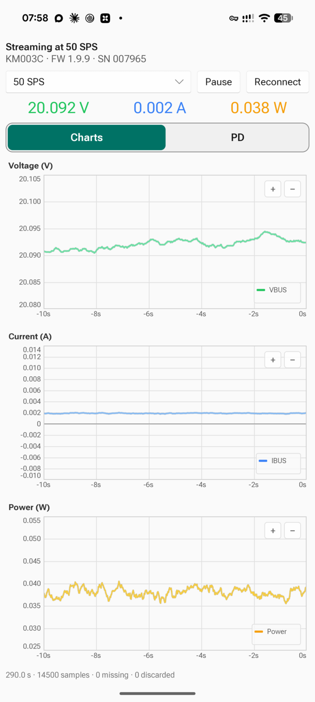
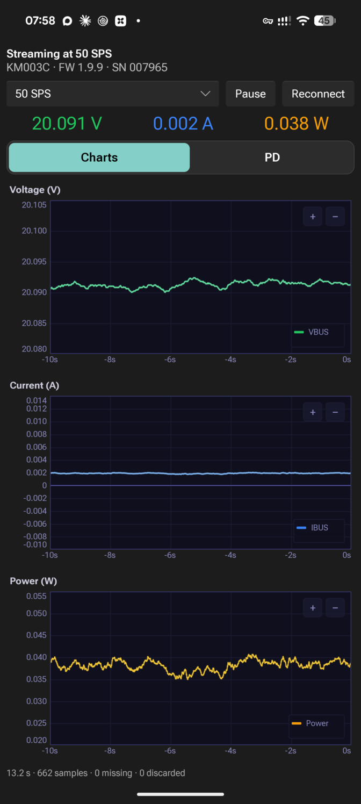
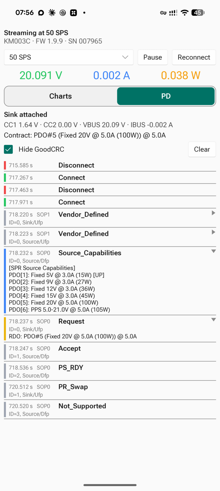

# km003c-slint

Experimental [Slint](https://slint.dev) monitor for the ChargerLAB POWER-Z
KM003C. It runs on desktop and on Android phones with USB host support, with
the meter plugged into the phone.

<p align="center">
  
  
  
</p>

It plots voltage, current and power from the AdcQueue stream at 2, 10, 50 or
1000 SPS. The charts are rendered on the GPU through a vendored copy of
[`slint-realtime-plot`](https://github.com/okhsunrog/slint_realtime_plotting_experiments),
which draws the samples as anti-aliased line segments when zoomed in and as a
min/max envelope when zoomed out. A 262,144-sample ring per chart holds
4.4 minutes at 1000 SPS or 87 minutes at 50 SPS.

Device handling is the same as in `km003c-egui`: both use the `session` and
`measurement` modules of `km003c-lib`. Gaps in the sample sequence show as
breaks in the line rather than being joined across.

- Pinch or scroll to zoom, double tap or double click to pause, drag to pan
  while paused. The time axis stays on the pause moment while data keeps
  arriving.
- The device reconnects on its own when it is replugged.
- The status line counts received, missing and discarded samples.
- On Android the screen stays on while the app is in front.

The PD tab shows whether a sink is attached, the CC1/CC2 and VBUS readings,
the power contract as the negotiation establishes it, and the PD message log
in time order. Tapping a message expands its PDOs or RDO; GoodCRC
acknowledgements are hidden by default. The log uses `pd_log` from
`km003c-lib`, the same formatter as the egui timeline.

Not yet ported from `km003c-egui`: recording to Parquet/CSV, offline logs, the
firmware PD trace, and metric selection per chart.

## Desktop

```bash
cd km003c-slint
cargo run --release
```

The crate is its own Cargo workspace, so Slint, wgpu and the patched `nusb`
below stay out of the main workspace, its lock file and CI.

## Android

nusb 0.2 has no device enumeration, hotplug or permission requests on
Android. [kevinmehall/nusb#150](https://github.com/kevinmehall/nusb/pull/150)
adds them through JNI; until it is merged, this workspace patches `nusb` to
that branch at a fixed revision. The rest of the stack is unchanged: the
session finds the device, opens it and reconnects as on desktop, without a
USB reset, which would need a fresh permission grant.

Build with [cargo-apk2](https://crates.io/crates/cargo-apk2):

```bash
rustup target add aarch64-linux-android
cargo install cargo-apk2

export ANDROID_HOME="$HOME/Android/Sdk"
export ANDROID_NDK_ROOT="$ANDROID_HOME/ndk/<version>"

cd km003c-slint
CARGO_APK_RELEASE_KEYSTORE=$HOME/.android/debug.keystore \
CARGO_APK_RELEASE_KEYSTORE_PASSWORD=android \
cargo apk2 build --release --lib --no-default-features --features android

adb install -r target/release/apk/km003c-slint.apk
```

If `~/.cargo/config.toml` sets `build.build-dir`, prefix the build with
`CARGO_BUILD_BUILD_DIR=$PWD/target`; otherwise packaging fails with a bare
`No such file or directory`.

On first attach Android asks whether to open the app for the KM003C. Tick
"Always": a permission requested at runtime lasts only until the device is
unplugged, while this one covers every later attach.

Logs go to logcat under the `km003c` tag at info level:

```bash
adb logcat 'km003c:V' '*:S'
```

## Licenses

The vendored `slint-realtime-plot` is MIT-licensed. Slint is used under its
royalty-free license, which asks for attribution:

[](https://slint.dev)
